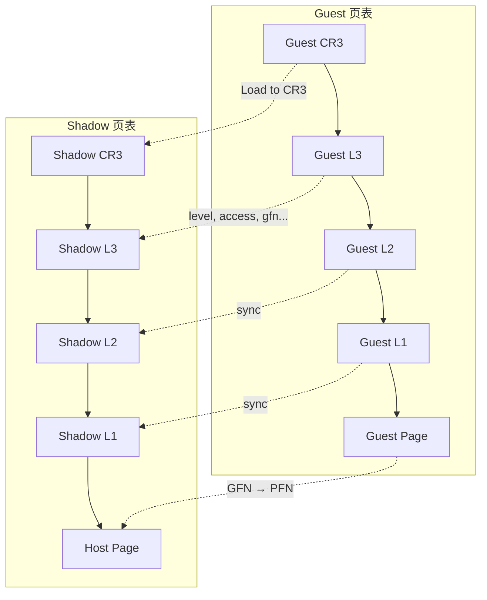

## EPT 出现的原因

### 早期的VM困境
 
对于 Guest OS 而言，他会自己维护一套标准的四级页表，做 **GVA → GPA** 的翻译。这套页表 guest 自己建、自己改，guest 以为自己拿到的 GPA(Guest Physical Address)就是真实的物理内存地址——但显然不是。而真实的物理内存却需要在多个 VM 之间复用和隔离，VMM 必须掌握 **GPA → HPA**(Host Physical Address)这一层真实映射，否则:
 
- 无法做内存隔离(VM A 不能读到 VM B 的物理内存)。
- 无法做内存超分配(overcommit)。
- 无法做热迁移(migration 时物理地址会变)。
- 无法做内存内省 / EPT Hook 这类需要在物理层面控制访问权限的操作。

问题是**硬件 MMU 原生只认识 CR3 指向的那一套页表**，它不知道还要再翻译一层到真实物理地址。
 
### 早期VM的内存管理

在 EPT 出现之前(以及不支持 EPT 的老 CPU 上)，这一层完全靠软件模拟，也就是 **Shadow Page Table**

#### Shadow Page

虚拟机管理程序使用“影子页表”来记录物理内存的状态。在用户模式下，虚拟机以为自己可以访问物理内存，但实际上，硬件会阻止虚拟机对物理内存的访问。

1. VMM 为每个 guest 页表维护一份"影子页表"，这份影子表才是真正装进物理 CR3 的东西，直接做 GVA → HPA 的翻译。
2. 影子表的内容 = guest 页表的映射关系，拼接上 VMM 自己维护的 GPA → HPA 映射。
3. 为了保证影子表和 guest 页表同步，VMM 必须能感知到 guest 对页表的任何修改。做法通常是把 guest 页表所在的物理页标记为**只读**，guest 一旦尝试写入(修改 PTE、切换 CR3 等)就触发 `#PF` → VM-exit → VMM 介入，手动模拟这次写入，再同步更新影子表。

流程如下:



这种做法的代价是**guest 内部几乎所有涉及页表的操作(进程切换、地址空间管理)都会触发 VM-exit**，而 VM-exit/VM-entry 本身的上下文切换开销就不小，叠加软件模拟内存管理这种高频操作，性能损失非常可观。这也是早期全虚拟化方案(比如 VMware 的软件 MMU 虚拟化)被诟病的核心原因。

现在这种做法已经不流行了，因为EPT显然强大的多。
 
## EPT 简介

> The extended page-table mechanism (EPT) is a feature that can be used to support the virtualization of physical memory. When EPT is in use, certain addresses that would normally be treated as physical addresses (and used to access memory) are instead treated as guest physical addresses. Guest physical addresses are translated by traversing a set of EPT paging structures to produce physical addresses that are used to access memory.

### EPT 的意义

EPT(Extended Page Tables，Intel 的叫法;AMD 对应的是 NPT/RVI)的思路很直接:**既然问题是"两层地址翻译"，那就让硬件原生支持二维页表遍历**。
 
- Guest 页表照常翻译 **GVA → GPA**，guest 想怎么改页表就怎么改，完全不需要被 trap，因为它触碰的始终是"假"的地址空间，不会影响真实物理内存的安全性。
- **EPT** 是另一套完全独立的页表结构，由 VMM 建立和维护，guest 完全不可见、不可访问，负责 **GPA → HPA** 的翻译。
- 每次内存访问，硬件自动执行"两次页表遍历"(2D page walk):先走 guest 页表拿到 GPA，再走 EPT 拿到 HPA。两层地址都可以被 TLB 缓存(EPT 对应的 TLB entry 按 EPTP 打标签，和 VPID 配合避免不同 VM 间的 TLB 污染)，命中之后开销几乎可以忽略。

带来的直接收益:
 
1. **guest 内部页表维护(切 CR3、改 PTE)不再需要 VM-exit**，相比 shadow paging 是数量级的性能提升，这也是 EPT/NPT 出现后虚拟化性能大幅提升的核心原因之一。
2. **VMM 对物理内存的控制权和 guest 完全解耦**——GPA → HPA 的映射关系可以随意调整，guest 无感知，这是内存超分配、热迁移、内存去重(KSM 之类)的硬件基础。
3. **EPT 的每一页有独立的 R/W/X 权限位**，一旦 guest 访问违反了 EPT 设定的权限，会触发专门的 `EPT_VIOLATION` VM-exit，并带上精确的 GPA、访问类型(读/写/取指)等信息。
 
### EPT 权限位

上面的的第三条可以留意一下，这其实也就是最潮的`EPT Hook`的关键。

对物理内存绝对的控制力，这也是它超出"性能优化"这个初衷、演变出一整个安全研究方向的原因。

因为 VMM 完全控制 EPT，而 EPT 的权限粒度是**每个物理页独立可控**，这就意味着 VMM 可以做出一些 guest 内部软件永远做不到的事情:
 
- **EPT Hook**:对同一个 GPA，构造两个不同的 EPT 视图——"执行视图"指向一份被 hook 过的 HPA(比如插入了跳板)，"读写视图"指向原始的 HPA。这样 guest 执行这段代码时被重定向，但任何试图读取该内存内容做完整性校验的操作(比如反调试、反 hook 检测)读到的仍然是干净的原始字节。这是纯软件 hook(inline hook 等)天然做不到的，因为软件 hook 必然会改动实际的指令字节。这也为游戏作弊的`内存外部读写`建立了坚实的基础。
- **内存访问监控**:把某些物理页设为不可读/不可写/不可执行，任何触碰都会 trap 到 VMM，可以用来做细粒度的内存访问追踪，不需要修改 guest 内部的任何代码。
- **反作弊 / EDR 的内存内省**:很多现代反作弊系统和终端检测方案的底层原理就是利用 EPT 违规来监控关键内存区域是否被非法读写，而这套监控逻辑运行在 guest 完全不可见、不可篡改的 root 模式里。

这也是为什么做 hypervisor 天然具备一部分反作弊/反调试研究的底层能力。
 
### VPID
 
VPID(Virtual Processor ID)经常和 EPT 一起被提到，但VPID与EPT不同:
 
- **EPT** 解决的是地址翻译问题(GPA → HPA)。
- **VPID** 解决的是 **TLB 污染** 问题——没有 VPID 的时候，每次 VM-entry/VM-exit 都需要 flush 全部 TLB，防止不同地址空间之间串数据。VPID 给每个虚拟处理器分配一个 ID，TLB entry 按 VPID 打标签，这样切换 VM 时不需要无脑全量 flush，只需要保证同一 VPID 内部的翻译不会串。

两者配合使用，但解决的是不同层面的开销问题，不能混为一谈。

## EPT 翻译

### GPA 解析为 HPA

参考下图，和[Windows内存管理](/posts/os/windows/memory/)虚拟地址到物理地址的转变很相似，对于一个VA转变PA需要walk四级页表，而GPA转变为HPA也需要walk四级页表。

如果你对OS的内存分页比较熟悉的话，你就会感觉EPT的内存分页也很熟悉。

此时的`EPTP`就是实现类似于Guest的`CR3`的作用，`CR3`用于提供`PML4`的地址而`EPTP`用于提供`EPT PML4`的地址。


### CPU 寻址

此时对于处理器而言他就会通过类似于下图的方式最终得到目标地址:


### EPT 性能分析

因为对于VMM而言他需要一套自己的内存管理，所以同样的类似于OS，为了方便内存管理，所以需要内存分页并且维护四级页表，也方便和Guest对齐，省去多余的麻烦。

但即便如此EPT也比SPT强大的多。

## EPT 实战

### 定义四级页表

#### EPTP

```c
typedef union _EPTP {
    ULONG64 All;
    struct {
        UINT64 MemoryType : 3;              // bit 2:0 (0 = Uncacheable (UC) - 6 = Write - back(WB))
        UINT64 PageWalkLength : 3;          // bit 5:3 (This value is 1 less than the EPT page-walk length) 
        UINT64 DirtyAndAceessEnabled : 1;   // bit 6  (Setting this control to 1 enables accessed and dirty flags for EPT)
        UINT64 Reserved1 : 5;               // bit 11:7 
        UINT64 PML4Address : 36;
        UINT64 Reserved2 : 16;
    }Fields;
}EPTP, *PEPTP;
```

与常规的分页机制类似，所有 EPT 表中的每个条目都是 64 位长。`EPT PML4E`、`EPT PDPTE` 和 `EPT PD` 其实是一样的，不过 `EPT PTE` 有一些细微的差别。

EPT PTE大概长这样:


#### EPT PML4

```c
typedef union _EPT_PML4E {
    ULONG64 All;
    struct {
        UINT64 Read : 1;                // bit 0
        UINT64 Write : 1;               // bit 1
        UINT64 Execute : 1;             // bit 2
        UINT64 Reserved1 : 5;           // bit 7:3 (Must be Zero)
        UINT64 Accessed : 1;            // bit 8
        UINT64 Ignored1 : 1;            // bit 9
        UINT64 ExecuteForUserMode : 1;  // bit 10
        UINT64 Ignored2 : 1;            // bit 11
        UINT64 PhysicalAddress : 36;    // bit (N-1):12 or Page-Frame-Number
        UINT64 Reserved2 : 4;           // bit 51:N
        UINT64 Ignored3 : 12;           // bit 63:52
    }Fields;
}EPT_PML4E, *PEPT_PML4E;
```

#### EPT PDPTE

```c
typedef union _EPT_PDPTE {
    ULONG64 All;
    struct {
        UINT64 Read : 1;                // bit 0
        UINT64 Write : 1;               // bit 1
        UINT64 Execute : 1;             // bit 2
        UINT64 Reserved1 : 5;           // bit 7:3 (Must be Zero)
        UINT64 Accessed : 1;            // bit 8
        UINT64 Ignored1 : 1;            // bit 9
        UINT64 ExecuteForUserMode : 1;  // bit 10
        UINT64 Ignored2 : 1;            // bit 11
        UINT64 PhysicalAddress : 36;    // bit (N-1):12 or Page-Frame-Number
        UINT64 Reserved2 : 4;           // bit 51:N
        UINT64 Ignored3 : 12;           // bit 63:52
    }Fields;
}EPT_PDPTE, *PEPT_PDPTE;
```

#### EPT PDE

```c
typedef union _EPT_PDE {
    ULONG64 All;
    struct {
        UINT64 Read : 1;                // bit 0
        UINT64 Write : 1;               // bit 1
        UINT64 Execute : 1;             // bit 2
        UINT64 Reserved1 : 5;           // bit 7:3 (Must be Zero)
        UINT64 Accessed : 1;            // bit 8
        UINT64 Ignored1 : 1;            // bit 9
        UINT64 ExecuteForUserMode : 1;  // bit 10
        UINT64 Ignored2 : 1;            // bit 11
        UINT64 PhysicalAddress : 36;    // bit (N-1):12 or Page-Frame-Number
        UINT64 Reserved2 : 4;           // bit 51:N
        UINT64 Ignored3 : 12;           // bit 63:52
    }Fields;
}EPT_PDE, *PEPT_PDE;
```

#### EPT PTE

```c
typedef union _EPT_PTE {
    ULONG64 All;
    struct {
        UINT64 Read : 1;                // bit 0
        UINT64 Write : 1;               // bit 1
        UINT64 Execute : 1;             // bit 2
        UINT64 EPTMemoryType : 3;       // bit 5:3 (EPT Memory type)
        UINT64 IgnorePAT : 1;           // bit 6
        UINT64 Ignored1 : 1;            // bit 7
        UINT64 AccessedFlag : 1;        // bit 8   
        UINT64 DirtyFlag : 1;           // bit 9
        UINT64 ExecuteForUserMode : 1;  // bit 10
        UINT64 Ignored2 : 1;            // bit 11
        UINT64 PhysicalAddress : 36;    // bit (N-1):12 or Page-Frame-Number
        UINT64 Reserved : 4;            // bit 51:N
        UINT64 Ignored3 : 11;           // bit 62:52
        UINT64 SuppressVE : 1;          // bit 63
    }Fields;
}EPT_PTE, *PEPT_PTE;
```

需要注意的是四级页表不是绝对的，对于VMM而言内存管理是自由的，你需要像OS一样管理内存，所以即便你选择别的方式管理内存也是可以的，比如你可以使用三级页表，也可以使用五级页表。

但是对于现代的OS而言四级页表一般来讲是内存分页的标准管理方式。

因为计算机嘛，每一个基础的设计往往是不够再加、不行再改。

### 构建四级页表

```c
UINT64 InitializeEptp()
{
    PAGED_CODE();

    // Allocate EPTP
    PEPTP EPTPointer = ExAllocatePoolWithTag(NonPagedPool, PAGE_SIZE, EPTP_POOLTAG);
    if (!EPTPointer)
    {
        return NULL;
    }
    RtlZeroMemory(EPTPointer, PAGE_SIZE);

    // Allocate EPT PML4
    PEPT_PML4E EptPml4 = ExAllocatePoolWithTag(NonPagedPool, PAGE_SIZE, EPTP_POOLTAG);
    if (!EptPml4)
    {
        ExFreePoolWithTag(EPTPointer, EPTP_POOLTAG);
        return NULL;
    }
    RtlZeroMemory(EptPml4, PAGE_SIZE);

    // Allocate EPT Page-Directory-Pointer-Table
    PEPT_PDPTE EptPdpt = ExAllocatePoolWithTag(NonPagedPool, PAGE_SIZE, EPTP_POOLTAG);
    if (!EptPdpt)
    {
        ExFreePoolWithTag(EptPml4, EPTP_POOLTAG);
        ExFreePoolWithTag(EPTPointer, EPTP_POOLTAG);
        return NULL;
    }
    RtlZeroMemory(EptPdpt, PAGE_SIZE);

	// Allocate EPT Page-Directory
    PEPT_PDE EptPd = ExAllocatePoolWithTag(NonPagedPool, PAGE_SIZE, EPTP_POOLTAG);
    if (!EptPd)
    {
        ExFreePoolWithTag(EptPdpt, EPTP_POOLTAG);
        ExFreePoolWithTag(EptPml4, EPTP_POOLTAG);
        ExFreePoolWithTag(EPTPointer, EPTP_POOLTAG);
        return NULL;
    }
    RtlZeroMemory(EptPd, PAGE_SIZE);

	// Allocate EPT Page-Table
    PEPT_PTE EptPt = ExAllocatePoolWithTag(NonPagedPool, PAGE_SIZE, EPTP_POOLTAG);
    if (!EptPt)
    {
        ExFreePoolWithTag(EptPd, EPTP_POOLTAG);
        ExFreePoolWithTag(EptPdpt, EPTP_POOLTAG);
        ExFreePoolWithTag(EptPml4, EPTP_POOLTAG);
        ExFreePoolWithTag(EPTPointer, EPTP_POOLTAG);
        return NULL;
    }
    RtlZeroMemory(EptPt, PAGE_SIZE);

    for (size_t i = 0; i < PagesToAllocate; i++)
    {
        EptPt[i].Fields.AccessedFlag            = 0;
        EptPt[i].Fields.DirtyFlag               = 0;
        EptPt[i].Fields.EPTMemoryType           = 6;
        EptPt[i].Fields.Execute                 = 1;
        EptPt[i].Fields.ExecuteForUserMode      = 0;
        EptPt[i].Fields.IgnorePAT               = 0;
        EptPt[i].Fields.PhysicalAddress         = (VirtualToPhysicalAddress(GuestMemory + (i * PAGE_SIZE)) / PAGE_SIZE);
        EptPt[i].Fields.Read                    = 1;
        EptPt[i].Fields.SuppressVE              = 0;
        EptPt[i].Fields.Write                   = 1;
    }

    // Setting up PDPTE
    EptPdpt->Fields.Accessed                = 0;
    EptPdpt->Fields.Execute                 = 1;
    EptPdpt->Fields.ExecuteForUserMode      = 0;
    EptPdpt->Fields.Ignored1                = 0;
    EptPdpt->Fields.Ignored2                = 0;
    EptPdpt->Fields.Ignored3                = 0;
    EptPdpt->Fields.PhysicalAddress         = (VirtualToPhysicalAddress(EptPd) / PAGE_SIZE);
    EptPdpt->Fields.Read                    = 1;
    EptPdpt->Fields.Reserved1               = 0;
    EptPdpt->Fields.Reserved2               = 0;
    EptPdpt->Fields.Write                   = 1;

    // Setting up PML4E
    EptPml4->Fields.Accessed                = 0;
    EptPml4->Fields.Execute                 = 1;
    EptPml4->Fields.ExecuteForUserMode      = 0;
    EptPml4->Fields.Ignored1                = 0;
    EptPml4->Fields.Ignored2                = 0;
    EptPml4->Fields.Ignored3                = 0;
    EptPml4->Fields.PhysicalAddress         = (VirtualToPhysicalAddress(EptPdpt) / PAGE_SIZE);
    EptPml4->Fields.Read                    = 1;
    EptPml4->Fields.Reserved1               = 0;
    EptPml4->Fields.Reserved2               = 0;
    EptPml4->Fields.Write                   = 1;

    // Setting up EPTP
    EPTPointer->Fields.DirtyAndAceessEnabled    = 1;
    EPTPointer->Fields.MemoryType               = 6;  // 6 = Write-back (WB)
    EPTPointer->Fields.PageWalkLength           = 3;  // 4 (tables walked) - 1 = 3
    EPTPointer->Fields.PML4Address              = (VirtualToPhysicalAddress(EptPml4) / PAGE_SIZE);
    EPTPointer->Fields.Reserved1                = 0;
    EPTPointer->Fields.Reserved2                = 0;

    InfoLog("Extended Page Table Pointer allocated at %llx", (UINT64)EPTPointer);
    return EPTPointer;
}
```

这样`EPTP`就初始化好了，接下来将EPTP接入`VMCS`即可。

---
 
## 总结
 
| | 解决的问题 | 没有它之前的方案 | 代价 |
|---|---|---|---|
| **VMX** | 特权指令执行权的仲裁 | Ring compression / 二进制翻译 | 需要修改 guest 或做指令重写，复杂且慢 |
| **EPT** | GPA → HPA 的地址翻译 | Shadow Page Table | guest 页表操作高频触发 VM-exit，内存密集负载性能差 |
 
VMX 让 guest 可以名义上独占 ring 0 而不需要修改自身;EPT 让"第二层地址翻译"这件事从软件模拟搬进硬件，顺带打开了一扇可编程内存权限控制的大门。两者合在一起，才是现代全虚拟化(以及基于此的 EPT Hook、内存内省等安全研究方向)的硬件基石。

## 参考

[Rayanfam Blog](https://rayanfam.com/topics/hypervisor-from-scratch-part-4/)

::github{repo=DarthTon/HyperBone}

::github{repo=ionescu007/SimpleVisor}

::github{repo=hyperdbg/hyperdbg}
