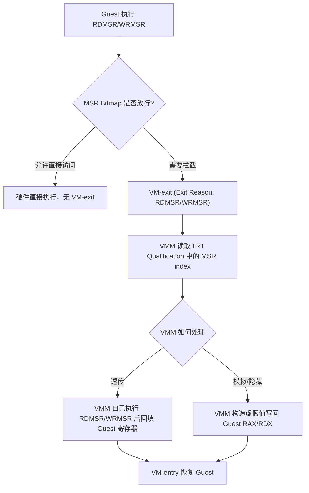

## MSR 是什么

`RAX`、`RBX`、`RCX` 等这些寄存器大家都很熟悉.

它们数量有限,编号固定，在逆向的过程中他是我们的老熟人。

但 x86 处理器内部还有一大堆**不参与日常运算，但控制着处理器行为本身**的寄存器——比如"要不要开启长模式"、"syscall 要跳到哪个地址"、"APIC 基地址在哪"、"性能计数器怎么配置"。

这类寄存器如果也按一般寄存器的方式编码进指令里，指令集会膨胀到无法维护，而且这些寄存器很多是**厂商/型号相关的**，Intel 和 AMD 之间、甚至 Intel 不同代际的 CPU 之间都可能不一样。

于是 Intel 和 AMD 都设计了一套**独立于通用寄存器的寄存器空间**，通过专门的指令 `RDMSR` / `WRMSR` 来访问，这就是 **MSR(Model Specific Register，模型特定寄存器)**。

## MSR 解决的问题

- **可扩展性**:MSR 用一个 32 位的"索引"(index/address)去访问，理论上有 2^32 个槽位可用，远超通用寄存器的数量上限，方便处理器一代代往里加新功能而不用改指令编码。
- **权限隔离**:`RDMSR`/`WRMSR` 都是特权指令，只能在 Ring 0 执行，用户态代码完全碰不到，天然把"控制处理器底层行为"这件事锁在了内核态。
- **厂商/型号差异化**:不同 CPU 型号可以有自己独有的 MSR(所以叫 Model *Specific*)，同时保留一批"架构 MSR"(Architectural MSR)作为跨代际、跨型号都保证存在且语义一致的基础设施，比如 `IA32_EFER`、`IA32_APIC_BASE`。

可以把 MSR 理解成处理器暴露出来的一整套"配置寄存器阵列"——每一个 MSR 都掌管着处理器某一块具体的行为，从长模式开关，到 syscall 跳转地址，到虚拟化能力探测，全部都在这里。

## MSR 的访问方式

### RDMSR / WRMSR

```asm
; 读取 MSR: ECX 指定索引
mov ecx, 0xC0000080   ; IA32_EFER
rdmsr

; 写入 MSR: ECX 指定索引
mov ecx, 0xC0000080
mov eax, 0x00000d01
mov edx, 0x00000000
wrmsr
```

寻址方式很简单粗暴:**ECX 里放 32 位索引，值永远是 64 位，通过 EDX:EAX 高低位拼接**。这个模式从 Pentium 时代一直延续到现在，非常稳定。

对应到 C 层面，一般会封装成这样的 intrinsic:

```c
UINT64 __readmsr(unsigned long Register);
void   __writemsr(unsigned long Register, UINT64 Value);
```

在 Windows 内核驱动里可以直接调用这两个 intrinsic(定义在 `intrin.h`)，不需要手写内联汇编。

### 访问权限与异常

`RDMSR`/`WRMSR` 是 CPL0-only 指令，用户态执行会触发 `#GP`。即便是在 Ring 0，访问一个**不存在**的 MSR 索引同样会 `#GP`——这也是很多反调试/反虚拟化检测的手段之一:故意读一个只有在 VMX root 模式或者特定 hypervisor 里才会被模拟出来的 MSR，观察是否 `#GP`,或者观察返回值是否符合"真实硬件"的预期。

## 常见且重要的 MSR

MSR 数量非常多，这里只列出与内核开发、虚拟化关系最密切的几类。

### 长模式与系统调用相关

| MSR | 索引 | 作用 |
|---|---|---|
| `IA32_EFER` | 0xC0000080 | 长模式开关(LME/LMA)、系统调用扩展开关(SCE)、NX 位开关(NXE) |
| `IA32_STAR` | 0xC0000081 | 32 位 syscall 使用的 CS/SS 段选择子 |
| `IA32_LSTAR` | 0xC0000082 | 64 位 `syscall` 指令跳转的目标地址，本质就是内核态系统调用入口的 RIP |
| `IA32_CSTAR` | 0xC0000083 | 兼容模式下的 syscall 目标地址 |
| `IA32_FMASK` | 0xC0000084 | syscall 时 RFLAGS 的掩码，决定哪些标志位在进入内核态时被清零 |

其中 `IA32_LSTAR` 是逆向和 hook 领域的常客——用户态一条 `syscall` 指令会跳转到内核的哪个地址。

比如在Windows中这个值就指向了 `KiSystemCall64` 这个函数的的序言也就是头部。

篡改它就等于劫持了整个系统Syscall的入口。

### 段基址相关

| MSR | 索引 | 作用 |
|---|---|---|
| `IA32_FS_BASE` | 0xC0000100 | FS 段基址，64 位下常用来指向 TEB |
| `IA32_GS_BASE` | 0xC0000101 | GS 段基址，64 位下内核态常用来指向 KPCR/per-CPU 数据 |
| `IA32_KERNEL_GS_BASE` | 0xC0000102 | 配合 `swapgs` 指令，在用户态/内核态切换时交换 GS 基址 |

这三个 MSR 本质上是给"段基址"这种传统上由段描述符提供的信息开了个后门——64 位模式下段限长检查基本形同虚设，但 FS/GS 的**基址**部分仍然有用，所以 Intel 专门用 MSR 承载它，配合 `swapgs` 实现用户态/内核态各自独立的 per-CPU 上下文指针。

### APIC 与中断相关

`IA32_APIC_BASE`(0x1B)控制 Local APIC 的映射基址，以及 APIC 是否处于 x2APIC 模式、是否被全局禁用。这个 MSR 在虚拟化里也很关键，因为 guest 对它的读写往往需要 VMM 介入模拟，才能正确反映 vAPIC 的状态。

### 内存类型相关

`MTRR`(Memory Type Range Registers)也是一组 MSR,比如 `IA32_MTRR_DEF_TYPE`、`IA32_MTRR_PHYSBASEn`/`PHYSMASKn`,它们决定物理地址范围的默认缓存类型(UC/WB/WC 等)。EPT 的 memory type 字段(还记得上一篇 EPT 文章里 `EPTP.MemoryType` 和 `EPT_PTE.EPTMemoryType`吗)在实际生效时会和 MTRR 的设定做合并判断，这也是为什么很多 hypervisor 在初始化 EPT 之前要先读一遍 guest 的 MTRR 配置。

### 虚拟化能力相关

- `IA32_FEATURE_CONTROL`: bit 0 是 lock 位，bit 2 是 "Enable VMX outside SMX" 位。**必须先设置 VMX enable 位并锁定，才能执行 `VMXON`**,如果 BIOS 里锁定了这个 MSR 却没开 VMX 位，`VMXON` 会直接失败。
- `IA32_VMX_BASIC`: 分配 VMXON Region 和 VMCS Region 时写入的 revision id 就来自这个 MSR 的低 31 位。
- `IA32_VMX_PINBASED_CTLS` / `IA32_VMX_PROCBASED_CTLS` / `IA32_VMX_PROCBASED_CTLS2` / `IA32_VMX_EXIT_CTLS` / `IA32_VMX_ENTRY_CTLS` 等一整组: 这些 MSR 描述了当前 CPU **允许**哪些 VMX 控制位被置 1 或置 0，写 VMCS 的控制字段之前，必须用这些 MSR 做能力校验，否则 `VMLAUNCH`/`VMRESUME` 会因为控制字段不合法而失败。

可以看到，**MSR 不只是"处理器配置项"这么简单——它同时也是 VMX 这一整套虚拟化扩展对外暴露能力边界的接口**。

没有这些 capability MSR，VMM 甚至不知道当前 CPU 支不支持某个特性，那是非常危险的。

## MSR 与虚拟化的关系

### VM-exit

在 VMX non-root 模式(guest)下执行 `RDMSR`/`WRMSR`,默认情况下(取决于 Processor-Based VM-Execution Controls 里的 `Use MSR bitmaps` 位是否开启)会无条件触发 VM-exit,退到 VMM 里由 VMM 决定:

- 是把这次访问**转发给真实硬件**执行(读写宿主机上真正的 MSR);
- 还是**拦截并模拟**一个虚假的值(比如向 guest 隐藏某些和虚拟化相关的 MSR,或者伪造性能计数器数值反调试)。



### MSR Bitmap

如果每次 guest 的 MSR 访问都无差别地触发 VM-exit,性能损耗会很明显(尤其是一些高频读取的 MSR,比如某些 guest 内部会频繁读 TSC 相关或者性能计数器相关的 MSR)。

所以 VMX 提供了 **MSR Bitmap** 机制，让 VMM 可以精细控制"哪些 MSR 的读/写需要拦截，哪些可以放行"。

MSR Bitmap 是一块 **4KB** 大小、物理地址对齐的内存区域，内部分成 4 个 1KB 的子区域:

```c
typedef struct _MSR_BITMAP
{
    UINT8 ReadLowMsrs[1024];   // 0x00000000 - 0x00001FFF 的读拦截位图
    UINT8 ReadHighMsrs[1024];  // 0xC0000000 - 0xC0001FFF 的读拦截位图
    UINT8 WriteLowMsrs[1024];  // 0x00000000 - 0x00001FFF 的写拦截位图
    UINT8 WriteHighMsrs[1024]; // 0xC0000000 - 0xC0001FFF 的写拦截位图
} MSR_BITMAP, *PMSR_BITMAP;
```

每个 MSR 索引对应位图里的**一个 bit**:置 1 表示"这个 MSR 的这类访问需要 VM-exit",置 0 表示"直接放行，不 trap"。

> [!WARNING]
> 注意范围只覆盖了 `0x00000000-0x00001FFF` 和 `0xC0000000-0xC0001FFF` 这两段——落在这两段之外的 MSR 索引，只要开启了 `Use MSR bitmaps`，访问就**必定**触发 VM-exit,没有绕过的余地。

MSR Bitmap 的物理地址通过 VMCS 的 `MSR_BITMAP_ADDRESS` 字段配置，同时需要在 Processor-Based VM-Execution Controls 里置位 `Use MSR bitmaps`,这套机制才会生效。

### VM-Entry / VM-Exit 的 MSR 载入与保存区

除了拦截 guest 主动执行的 `RDMSR`/`WRMSR`,VMX 还提供了另一套机制——**在 VM-entry/VM-exit 这两个"边界时刻"自动批量加载/保存一组 MSR**,不需要 guest 自己执行任何指令，也不需要 VMM 手写 `RDMSR`/`WRMSR` 去逐个搬运。这对应 VMCS 里三个区域:

- **VM-Entry MSR-Load Area**:VM-entry 时，VMM 提前准备好一组"guest 应该具有的 MSR 值"，硬件在进入 guest 之前自动写入。
- **VM-Exit MSR-Store Area**:VM-exit 发生的瞬间，硬件自动把 guest 当前的这组 MSR 值保存下来，供 VMM 后续查看或者在下次 VM-entry 时恢复。
- **VM-Exit MSR-Load Area**:VM-exit 发生后，硬件自动把这组 MSR 恢复成"host 应有的值"，避免 host 代码在 root 模式下被 guest 遗留的 MSR 状态干扰。

三个区域的条目格式是一样的:

```c
typedef struct _VMX_MSR_ENTRY
{
    UINT32 MsrIndex;      // MSR 索引
    UINT32 Reserved;      // 保留位，必须为 0
    UINT64 MsrData;       // 64 位 MSR 值
} VMX_MSR_ENTRY, *PVMX_MSR_ENTRY;
```

典型的用法是把 `IA32_EFER`、`IA32_PAT` 这类"host 和 guest 必须严格区分、且切换开销可以接受批量搬运"的 MSR 放进这三个区域,让硬件自动处理,而不是每次都靠 VM-exit 陷入再手动 `RDMSR`/`WRMSR`。相比之下，MSR Bitmap 拦截更适合 guest 会主动、频繁访问，且 VMM 需要按需决定是否模拟的场景，两者是互补关系而不是取代关系。

## 总结

| | 解决的问题 | 访问方式 | 与虚拟化的关系 |
|---|---|---|---|
| **MSR** | 处理器底层配置/状态的可扩展存取 | `RDMSR`/`WRMSR`,ECX 给索引，EDX:EAX 给值 | VMX 自身的开关、能力探测都靠 MSR;guest 对 MSR 的访问可以被 MSR Bitmap 精细拦截，也可以通过 VM-Entry/VM-Exit MSR 区自动批量搬运 |

MSR 像是**处理器整体行为的控制面板**——从要不要开长模式，到 syscall 跳去哪，到 VMX 能力边界在哪，几乎处理器每一个"模式开关"都藏在某个 MSR 里。

对 hypervisor 开发而言，MSR 既是启动 VMX 的必经之路，也是 guest/host 边界上一处需要精细拦截和模拟的关键接口，理解它是继续往下做 VM-exit 处理、反检测、syscall hook 这些方向的基础。

## 参考

[Intel SDM Volume 3, Chapter 2 - Model-Specific Registers (MSRs)](https://www.intel.com/content/www/us/en/developer/articles/technical/intel-sdm.html)
