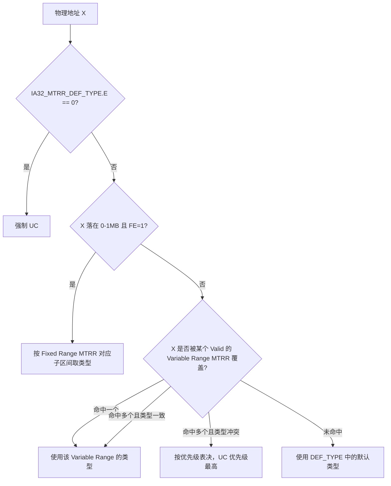

## MTRR 是什么

`MTRR`(Memory Type Range Registers，内存类型范围寄存器)本质上也是一组 MSR，只不过它们的职责很单一:

**告诉处理器某一段物理地址空间应该按什么内存类型来访问**——也就是这段地址能不能被 cache、用什么样的 cache 策略、写操作要不要立刻穿透到内存。

这件事之所以需要专门的机制去描述，是因为同一颗 CPU 面对的物理地址空间并不是铁板一块的

- RAM一部分是真正的内存条，可以放心大胆地 cache;
- 一部分是显卡、网卡之类设备映射出来的 MMIO 寄存器，访问它们必须**每次都真实落地到设备**，一旦被 cache 住，设备状态读出来就是一堆过期垃圾，甚至可能因为写操作被 cache 延迟而导致设备行为错乱。

## MTRR 解决的问题

- **地址空间的内存类型分区**:处理器需要知道"这段物理地址是内存，那段是设备寄存器"，而这个划分在不同主板、不同 BIOS 上是不固定的，不可能写死在硬件逻辑里，必须留一个可配置的接口——这就是 MTRR。
- **兼容遗留的 640KB-1MB 区域**:x86 历史包袱很重，0xA0000-0xFFFFF 这段历史上被显存、BIOS ROM 各种设备瓜分过，粒度要求比普通 RAM 细得多，所以 Intel 专门为这段区域设计了粒度更细的 **Fixed Range MTRR**。
- **为 1MB 以上的地址空间提供粗粒度、可变大小的划分**:这部分交给 **Variable Range MTRR**，数量有限(通常 8~10 对)，但支持任意 2 的幂大小、任意对齐的地址范围。
- **与 PAT、EPT 协同工作**:MTRR 只是"内存类型"这套体系里最底层、最贴近硬件拓扑的一层，再往上还有 PAT(Page Attribute Table，页表级别的类型覆盖)和虚拟化场景下的 EPT memory type，三者需要按固定规则合并出最终生效的类型。

## MTRR 的分类

### Fixed Range MTRR

覆盖 `0x00000000` - `0x000FFFFF`(也就是经典的前 1MB 地址空间)，一共 11 个 MSR，按粒度分三档:

| MSR | 索引 | 覆盖范围 | 单个子区间粒度 |
|---|---|---|---|
| `IA32_MTRR_FIX64K_00000` | 0x250 | 0x00000 - 0x7FFFF | 64KB |
| `IA32_MTRR_FIX16K_80000` | 0x258 | 0x80000 - 0x9FFFF | 16KB |
| `IA32_MTRR_FIX16K_A0000` | 0x259 | 0xA0000 - 0xBFFFF | 16KB |
| `IA32_MTRR_FIX4K_C0000` ~ `IA32_MTRR_FIX4K_F8000` | 0x268 ~ 0x26F | 0xC0000 - 0xFFFFF | 4KB |

每一个 Fixed Range MTRR 都是 64 位，内部按 **8 个字节**切分，每个字节独立编码一个子区间的内存类型:

```c
// 以 IA32_MTRR_FIX64K_00000 为例，覆盖 0x00000-0x7FFFF
// 8 个字节分别对应 8 个 64KB 子区间
typedef union _MTRR_FIXED_ENTRY
{
    UINT64 AsUInt64;
    struct
    {
        UINT8 Type0; // 0x00000 - 0x0FFFF
        UINT8 Type1; // 0x10000 - 0x1FFFF
        UINT8 Type2; // 0x20000 - 0x2FFFF
        UINT8 Type3; // 0x30000 - 0x3FFFF
        UINT8 Type4; // 0x40000 - 0x4FFFF
        UINT8 Type5; // 0x50000 - 0x5FFFF
        UINT8 Type6; // 0x60000 - 0x6FFFF
        UINT8 Type7; // 0x70000 - 0x7FFFF
    };
} MTRR_FIXED_ENTRY;
```

### Variable Range MTRR

覆盖 1MB 以上的地址空间，数量由 `IA32_MTRR_CAP` 的 `VCNT` 字段决定(现代 CPU 常见是 8~10 对)，每一对由 **PHYSBASEn / PHYSMASKn** 组成，索引从 `0x200` 开始交替排列:

```
IA32_MTRR_PHYSBASE0  0x200
IA32_MTRR_PHYSMASK0  0x201
IA32_MTRR_PHYSBASE1  0x202
IA32_MTRR_PHYSMASK1  0x203
...
```

```c
typedef union _MTRR_PHYSBASE
{
    UINT64 AsUInt64;
    struct
    {
        UINT64 Type       : 8;  // 内存类型
        UINT64 Reserved1  : 4;  // 必须为 0
        UINT64 PhysBase   : 36; // 物理基址(按最大物理地址位宽截断)
        UINT64 Reserved2  : 16;
    };
} MTRR_PHYSBASE;

typedef union _MTRR_PHYSMASK
{
    UINT64 AsUInt64;
    struct
    {
        UINT64 Reserved1 : 11;
        UINT64 Valid     : 1;   // 该 Variable Range MTRR 是否生效
        UINT64 PhysMask  : 36;  // 掩码，决定覆盖范围大小
        UINT64 Reserved2 : 16;
    };
} MTRR_PHYSMASK;
```

`PhysMask` 的语义和分页里的 mask 类似:**PHYSBASE 与 PHYSMASK 按位与之后的结果，必须还原成一段连续、大小为 2 的幂、且自然对齐的物理地址范围**。

硬件不会检查这个约束，但如果配置错了会直接导致未定义行为.

## 内存类型编码

Fixed 和 Variable Range MTRR 里的 `Type` 字段用的是同一套编码:

| 值 | 类型 | 含义 |
|---|---|---|
| 0 | UC | Uncacheable，完全不缓存，读写都直接落地，MMIO 的标准选择 |
| 1 | WC | Write Combining，写操作先合并再批量提交，常用于显存等对写延迟不敏感、追求带宽的场景 |
| 4 | WT | Write Through，读可以缓存，写会同时更新 cache 和内存 |
| 5 | WP | Write Protected，读可以缓存，写直接穿透到内存并使其他 cache line 失效 |
| 6 | WB | Write Back，读写都走 cache，cache line 脏了才会延迟写回，性能最好，普通 RAM 的默认选择 |

2、3、7 及以上为保留值，写入非法值同样会引发 `#GP`。

## 相关 MSR

| MSR | 索引 | 作用 |
|---|---|---|
| `IA32_MTRR_CAP` | 0xFE | 只读，报告当前 CPU 的 MTRR 能力:`VCNT`(Variable Range 数量)、`FIX`(是否支持 Fixed Range)、`WC`(是否支持 WC 类型)、`SMRR`(是否支持 SMM 专用的 SMRR) |
| `IA32_MTRR_DEF_TYPE` | 0x2FF | 全局默认类型(bit 0-7)，`FE` 位(bit 10，是否启用 Fixed Range MTRR)，`E` 位(bit 11，MTRR 总开关) |

`IA32_MTRR_DEF_TYPE` 的 `E` 位是最关键的开关——**一旦为 0，整个物理地址空间的所有访问都被视为 UC**，不管其他 MTRR 怎么配置都不生效。

没有被任何 Fixed/Variable Range MTRR 覆盖到的地址，统一按 `DEF_TYPE` 里的默认类型处理。

## MTRR 的地址解析优先级

一段物理地址落在哪个类型上，按下面的顺序判定:



多个 Variable Range MTRR 重叠且类型不一致时，处理器遵循固定优先级:**只要其中一个是 UC，结果就是 UC**;如果没有 UC 但存在 WT 和 WB 混合，行为在架构手册里被列为"未定义"，实践中 BIOS/固件会保证不产生这种重叠，OS 和 hypervisor 层通常也不应该主动制造这种冲突。

## MTRR 与 EPT 的合并规则

Guest 在 non-root 模式下访问一段 GPA，最终落到 HPA 需要经过 **EPT 分页结构**。

EPT PTE 里同样带有一个 `EPT Memory Type` 字段，但这个字段描述的是"VMM 认为这段 guest 物理内存应该按什么类型访问"，而 `MTRR` 描述的是"host 物理地址在真实硬件层面应该按什么类型访问"——**两者最终会作用在同一段真实的物理内存上，必须合并出一个统一生效的类型**，否则同一块物理内存被两套不一致的缓存策略同时管理，会导致缓存一致性问题。

合并规则由 `IA32_VMX_BASIC` 的相关能力位决定是否启用，一旦启用，Intel SDM 给出的简化合并逻辑大致是:

| MTRR 类型 | EPT 类型 | 生效类型 |
|---|---|---|
| UC | 任意 | UC(MTRR 的 UC 具有最高优先级，不可被 EPT 覆盖) |
| 非 UC | WB | 使用 MTRR 的类型 |
| 非 UC | 非 WB(如 UC/WC/WT/WP) | 使用 EPT 的类型 |

换句话说**只要 host 侧 MTRR 认为这段物理地址是 UC，不管 guest/EPT 怎么配置，最终一律按 UC 处理**，这是一条安全兜底规则，防止错误配置而导致真实的设备寄存器错误地被缓存起来。

## 总结

实际系统里内存类型是三层叠加的:

- **MTRR**:物理地址维度，BIOS 固件配置，描述"这块物理内存本身适合什么类型"，hypervisor 通常只读取、不修改。
- **PAT**:页表维度(线性地址)，OS 通过页表项里的 PAT/PCD/PWT 组合位选择一个 PAT 表项，可以在页粒度上覆盖 MTRR 的建议类型。
- **EPT Memory Type**:虚拟化场景下，GPA 到 HPA 转换路径上新增的一层类型描述，最终要和 MTRR(以及是否忽略 guest PAT)合并出真正落地到硬件的类型。

对 hypervisor 开发而言，MTRR 很重要，配置错误则触发 #MC 。

但话说回来操作一个本身就十分复杂敏感的系统，搞错哪一个都是十分严重的就是了。

## 参考

[Intel SDM Volume 3, Chapter 12 - Memory Type Range Registers (MTRRs)](https://www.intel.com/content/www/us/en/developer/articles/technical/intel-sdm.html)

[Intel SDM Volume 3, Chapter 28.2.6 - EPT and Memory Typing](https://www.intel.com/content/www/us/en/developer/articles/technical/intel-sdm.html)
