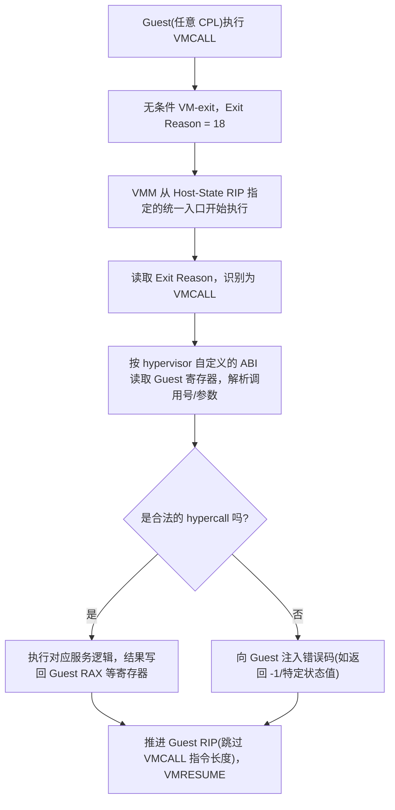

## VMCALL 是什么

`VMCALL` 属于 VMX 指令集的一员，和 `VMXON`/`VMLAUNCH`/`VMPTRLD` 是同一批指令，但语义上它不操作 VMCS，而是单纯**制造一次可控的、guest 主动发起的 VM-exit**。

guest 操作系统或者 guest 里的应用，可以借助它向底层的 hypervisor 请求服务——查询虚拟化环境信息、请求特殊的内存映射、触发 hypervisor 侧实现的某个功能，这一整套机制通常被称为 **hypercall**。

## VMCALL 在 Guest下执行

这是 VMCALL 最核心的用法。

Intel SDM 把 VMCALL 归入**无条件触发 VM-exit 的指令**这一类——不管 Processor-Based/Secondary VM-Execution Controls 怎么配置，也不管有没有开 MSR Bitmap 之类的精细拦截机制，只要 guest 执行了 `VMCALL`，**必然** VM-exit，Exit Reason 固定是 `18`(VMCALL)。

对比 `RDMSR`/`WRMSR` :MSR 访问是不是拦截，取决于 MSR Bitmap 里对应 bit 的状态，VMM 可以选择放行;而 VMCALL 从设计上就没给 VMM 留"放行"的选项——它天然就是拿来触发 VM-exit 的，如果不想 trap，guest 就不应该执行它。

VMCALL 的 VM-exit **不带 Exit Qualification 里那种"这次访问了哪个具体对象"的语义信息**——不像 `RDMSR`/`WRMSR` 的 exit 能从 guest ECX 拿到 MSR index、`CR` 访问的 exit qualification 能直接告诉你操作的是哪个控制寄存器。

VMCALL 的参数传递**完全没有架构规定**，调用号放哪个寄存器、参数怎么传、返回值写回哪里，全部由 hypervisor 自己定义一套 ABI，guest 侧配合这套 ABI 编写代码。

也正因为如此，不同 hypervisor 的 hypercall 约定彼此完全不兼容:

| Hypervisor | 典型约定 |
|---|---|
| Microsoft Hyper-V | `RCX` = 调用码 + 标志位，`RDX` = 输入参数 GPA，`R8` = 输出参数 GPA，返回值在 `RAX` |
| KVM(x86)| `RAX` = 调用号，`RBI/RCX/RDX/RSI` 传参，依赖 `KVM_HYPERCALL` 宏封装 |
| VMware(部分场景) | 历史上更多走 I/O port "backdoor" 而非 VMCALL，但新版本也支持 VMCALL 通道 |

因为 VMCALL 的 VM-exit 是无条件的、且**不检查 guest CPL**，理论上 guest 里哪怕是 ring3 的用户态代码，也能直接执行一条裸的 `VMCALL` 指令触发 exit。

这一点在反外挂/反作弊相关的研究里是个值得留意的点。

这里的 `vmcall` 就可以实现类似于 `syscall` 的效果。

> [!NOTE]
> 这里对于vmcall是否会被处理取决于 hypervisor ，比如微软自己的 HyperV hypervisor 就会拒绝 CPL 非零的 VMCALL

如下：

> VTL calls can only be initiated from the most privileged processor mode. For example, on x64 systems a VTL call can only come from CPL0, and on ARM64 systems from EL1. A VTL call initiated from a processor mode which is anything but the most privileged on the system results in the hypervisor injecting an exception into the virtual processor (#UD on x64, undefined instruction exception on ARM64).

具体请看参考。

## VMCALL 在 VMX root下执行

这个是一个非常特别、大部分 hypervisor 不会用到的特性:**dual-monitor treatment of SMI 和 SMM**(SMM 双监控机制)。

简单说:x86 除了 Ring0-3 和 VMX root/non-root 这两条维度之外，还有一个更特殊的执行模式叫 **SMM(System Management Mode)**，由 SMI 中断触发，权限比 VMX root 还要高，传统上完全绕开了 hypervisor 的管辖范围。

这就是 hypervisor R-1层 外，著名的 R-2层。

这对做安全隔离的场景是个问题，因为固件里的 SMM handler 出了漏洞，理论上可以完全无视 VMM 的存在为所欲为。

Intel 为此设计了 dual-monitor 机制:允许把 SMM 的处理也纳入 VMX 框架管理，由一个专门的 **STM(SMM-Transfer Monitor)** 去接管 SMI。

而 **VMCALL 在 VMX root 操作下执行，就是"普通 VMM主动把控制权转交给 STM"的触发指令**。它要求:

- 处理器已经通过 `IA32_SMM_MONITOR_CTL` MSR 配置好了 dual-monitor 环境(bit 0 的 Valid 位被置位，且指向了一个合法的 SMM-transfer VMCS);
- 当前不处于 SMM 内部;
- CPL 为 0。

只有上述条件全部满足，VMX root 下执行 `VMCALL` 才会正确地把控制权转交给 STM 去处理挂起的 SMI。

> [!NOTE]
> **如果这套 dual-monitor 环境根本没配置**，VMX root 下执行 VMCALL 不会有任何"合法"的效果，处理器会直接产生 `#GP(0)`——本质上跟你在没做任何准备的情况下瞎执行一条特权指令没有区别。

所以**在自己写的 VM-exit handler里，理论上永远不应该主动执行 VMCALL**，它是专属于 SMM 双监控这一特定场景的信令指令，和日常的 hypervisor 开发路径基本没有交集。

VM-exit handler 需要向更高层汇报或求助的场景，正常做法是记录状态、返回错误、或者干脆 `int 3`，因为我们无路可走，而不是指望更底层的兜底方式。

## 和 KiSystemCall64 的对比

`VMCALL` 的 guest→host 路径和 Windows 里 `syscall` 指令触发的 `KiSystemCall64` 用户态→内核态路径在低特权主动请求高特权服务这个设计思路上高度相似，但细节差异也很值得对比着看:

| 维度 | `syscall` → `KiSystemCall64` | `VMCALL` → VM-exit Handler |
|---|---|---|
| 触发方 | Ring3 用户态代码 | Guest(CPL=Any) |
| 目标特权层 | Ring0 内核态 | VMX root(host/VMM) |
| 入口地址来源 | `IA32_LSTAR` MSR 里预先写好的固定 RIP | VMCS Host-State Area 的 `HOST_RIP` 字段，VMLAUNCH/VMRESUME 时生效 |
| 调用号/参数约定 | 架构层面无强制，但 Windows 有事实标准:`RAX` = SSDT 索引，`RCX/RDX/R8/R9` + 栈传参 | 完全没有架构或事实标准，每个 hypervisor 自己定义 |
| 分发方式 | 单一入口 `KiSystemCall64` 内部按 `RAX` 查 `KeServiceDescriptorTable` 分发 | 单一入口按 `Exit Reason` 字段分发 |
| 返回指令 | `SYSRET`/`SYSEXIT`，只需切换 CS/SS/RIP/RFLAGS，代价很低 | `VMRESUME`，需要恢复完整 Guest-State Area，代价高得多 |
| 单次往返开销 | 通常几十到一百多个周期 | 通常几百到上千个周期(VM-exit/entry 本身的微架构开销 + 可能的 TLB/cache 效应) |
| 反向对称的"root 执行会怎样" | Ring0 代码执行 `syscall` 在硬件层面依然会正常触发，不检查当前 CPL 是不是已经是 0，会重新跳进 `KiSystemCall64`，容易造成诡异的重入行为，但 Windows 应该有对应检查 | VMX root 下执行 `VMCALL` 不会重入 VM-exit handler，而是被定向到 dual-monitor SMM 这一完全不同的机制，配置不当直接 `#GP` |

从这张表能看出一个共同的设计模式:

**两者都是"单一固定入口 + 事后按某个字段做分发"**，syscall 靠 `RAX` 查 SSDT，VMCALL 靠 `Exit Reason` 查 VMM 自己写的分发表"。

熟悉 syscall 的应该会有点感触。

差异也很明显: syscall 这条路径，操作系统对参数约定有绝对话语权，因为 ring3/ring0 跑的是同一套 OS。

而 VMCALL 这条路径，guest 和 host 完全可能是两套毫无关联的软件，所以参数约定必须是 hypervisor 单方面定义、guest 侧驱动主动配合的东西。

## 总结

| | 触发条件 | 是否可被 VMM 选择性拦截 | 典型用途 |
|---|---|---|---|
| **VMCALL(non-root/guest 执行)** | Guest 主动执行，任意 CPL | 否，无条件 VM-exit | Hypercall，guest 向 VMM 请求服务的标准入口 |
| **VMCALL(root 执行)** | VMX root 下执行 | 不适用(不是拦截语义) | SMM 双监控(STM)信令，配置不当直接 `#GP`，不是通用调用机制 |

`VMCALL` 便是 Guest 与 Host 沟通的桥梁。

## 参考

### Intel SDM

[Intel SDM Volume 3, Chapter 25.1.2 - Instructions That Cause VM Exits Unconditionally](https://www.intel.com/content/www/us/en/developer/articles/technical/intel-sdm.html)

[Intel SDM Volume 3, Chapter 30.3 - VMCALL — Call to VM Monitor](https://www.intel.com/content/www/us/en/developer/articles/technical/intel-sdm.html)

[Intel SDM Volume 3, Chapter 34 - System Management Mode (Dual-Monitor Treatment of SMIs and SMM)](https://www.intel.com/content/www/us/en/developer/articles/technical/intel-sdm.html)

> VM exit occurs unconditionally if executed in VMX non-root operation, regardless of CPL.
> #GP(0) fault only when executed in VMX root operation with CPL>0.

### VM-Exit Behavior (Chapter 25.1.2)

> VMCALL is listed among instructions that unconditionally cause VM exits when executed in VMX non-root operation, alongside VMCLEAR, VMLAUNCH, VMPTRLD, VMPTRST, VMRESUME, VMXOFF, and VMXON.

### VMX Overview — Privilege Model (Chapter 24.1)

> A key architectural point regarding CPL and VMX operation: Because VMX operation places restrictions even on software running with current privilege level (CPL) 0, guest software can run at the privilege level for which it was originally designed. 

> This is the underlying reason VMCALL has no CPL check — the isolation boundary is enforced via VM-exit at the *architecture* level, not via instruction-level privilege checks like GP faults on CPL > 0.

### Community Summary

**Source:** github.com/ayoubfaouzi/cpu-internals

> Confirms the same unconditional VM-exit grouping: INVEPT, INVVPID, VMCALL, VMCLEAR, VMLAUNCH, VMPTRLD, VMPTRST, VMRESUME, VMXOFF, and VMXON  all cause VM exits regardless of VM-execution control settings.

###  Microsoft Hyper-V TLFS — VTL Call Restriction

**Source:** Hyper-V Top Level Functional Specification (TLFS), Virtual Secure Mode (VSM) chapter
**URL:** https://learn.microsoft.com/en-us/virtualization/hyper-v-on-windows/tlfs/vsm

> VTL calls can only be initiated from the most privileged processor mode. For example, on x64 systems a VTL call can only come from CPL0, and on ARM64 systems from EL1. A VTL call initiated from a processor mode which is anything but the most privileged on the system results in the hypervisor injecting an exception into the virtual processor (#UD on x64, undefined instruction exception on ARM64).
